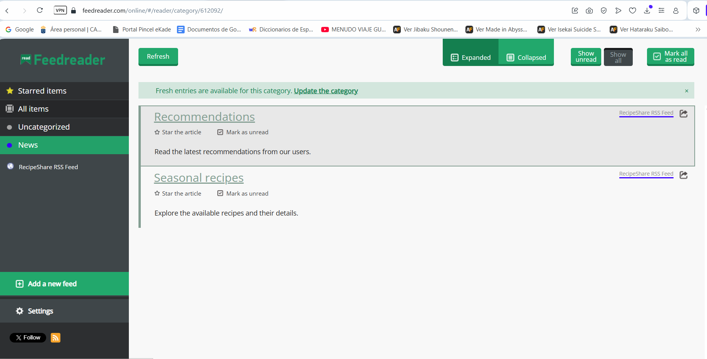

# My Project: Recipe Page

Welcome to my proyect! This website will let you explore delicious recipes and share your own creations with the community.

# Features

Explore Recipes: Discover a wide variety of recipes — from traditional dishes to more innovative options, including vegetarian recipes, gluten-free meals, irresistible desserts, and quick everyday meals. You will be able:

Leave Comments: Share your thoughts and tips on the recipes. (working on it)

Upload Your Own Recipes: Share your favorite dishes with the community.

Favorites: Save your favorite recipes for quick access.(working on it)

# Technologies Used

Frontend: React (JSX), CSS3, JavaScript

Backend & Database: Firebase.

# Acknowledgments

- Language Teacher: Tiburcio Cruz.

- Classmate: Enrique Pérez García.

- Classmate: Adrian Bienvenido Morales Perdomo.

- Links: 
https://github.com/othneildrew/Best-README-Template

https://www.shopify.com/es/blog/imagenes-para-web-tamano#

https://www.youtube.com/watch?v=oUs0j97Jo3A

# Feedreader

# Contact

Victoria Raaz Araujo - victoriaalejandraraazaraujo@alumno.ieselrincon.es

Project Link: https://addrecipes-43083.web.app
